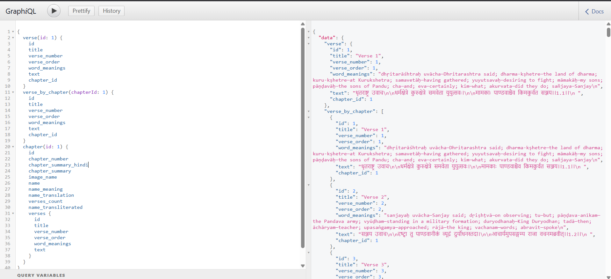

# Bhagavad Gita GraphQL API

A GraphQL API for accessing Bhagavad Gita verses, chapters, and authors. This API provides structured access to the sacred text with features like verse lookup, chapter information, and author details.

## Features

- Access to all 700+ verses of Bhagavad Gita
- Chapter information with summaries
- Author details
- Verse translations and transliterations
- Word meanings
- Interactive GraphQL interface for testing queries

## Screenshots


*GraphQL Interface showing example query and response*

## Prerequisites

- Node.js (v12 or higher)
- npm (Node Package Manager)

## Installation

1. Clone the repository:
```bash
git clone https://github.com/developer-shubham101/GraphQL-API-NodeJS.git
cd GraphQL-API-NodeJS
```

2. Install dependencies:
```bash
npm install
```

## Running the Server

For production:
```bash
npm start
```

For development (with auto-reload):
```bash
npm run devStart
```

The server will start at:
- Main URL: http://localhost:1337
- GraphiQL Interface: http://localhost:1337/graphiql

## Available Queries

### Verses
- Get all verses: `verses`
- Get verse by ID: `verse(id: Int)`
- Get verses by chapter: `verse_by_chapter(chapterId: Int)`

### Chapters
- Get all chapters: `chapters`
- Get chapter by ID: `chapter(id: Int)`

### Authors
- Get all authors: `authors`

## Example Queries

```graphql
# Get all chapters
{
  chapters {
    id
    name
    chapter_number
    verses_count
  }
}

# Get verses from a specific chapter
{
  verse_by_chapter(chapterId: 1) {
    verse_number
    text
    transliteration
    word_meanings
  }
}

# Get a specific verse
{
  verse(id: 1) {
    text
    transliteration
    word_meanings
  }
}
```

## API Structure

### Verse Type
- id: Int
- chapter_number: Int
- chapter_id: Int
- externalId: Int
- text: String
- title: String
- verse_number: Int
- verse_order: Int
- transliteration: String
- word_meanings: String

### Chapter Type
- id: Int
- chapter_number: Int
- chapter_summary: String
- chapter_summary_hindi: String
- image_name: String
- name: String
- name_meaning: String
- name_translation: String
- name_transliterated: String
- verses_count: Int
- verses: [Verse]

### Author Type
- id: Int
- name: String

## License

This project is licensed under the MIT License - see the [LICENSE](LICENSE) file for details.
